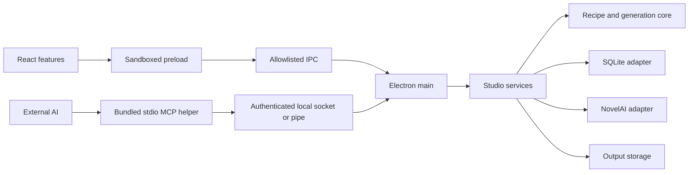

# 아키텍처

UI와 MCP가 같은 서비스와 데이터 계약을 사용합니다. 프롬프트 조립과 정책 검사는 플랫폼에 의존하지 않고, 파일·네트워크·보안 저장은 어댑터와 Electron main에서 처리합니다.

| 폴더 | 책임 |
| --- | --- |
| `contracts/` | 버전이 있는 DTO·명령 입력·오류·이벤트 |
| `core/` | 레시피 조립·검사·비용 정책·범용 팔레트 |
| `lib/` | 기존 동작을 유지하는 순수 프롬프트·블록 유틸리티 |
| `services/` | CRUD·버전 충돌·생성 계획·승인·순차 작업, 셋업 |
| `adapters/` | SQLite·NovelAI 요청·이미지 저장 |
| `features/` | 레시피 편집·생성·갤러리·팔레트·캐릭터·설정 화면 |
| `i18n/` | ko·ja·en 리소스와 언어 선택 |
| `desktop/main/` | 앱 수명·창·토큰·IPC·프로토콜·네이티브 대화상자 |
| `desktop/preload/` | 좁은 `StudioClient` 브리지 |
| `desktop/mcp/` | MCP SDK·stdio·로컬 인증·권한 경계 |
| `skills/recipe-studio/` | 동봉하고 설치하는 스킬 원본 |

## 화면 유지

기존 웹 스튜디오의 Tailwind·shadcn 테마와 레이아웃을 재사용합니다. 전역 CSS의 추가 사항은 Electron renderer 밖에 있는 컴포넌트 검색 경로와 로컬 Geist 폰트 연결입니다. 별도의 테마를 덮어씌우지 않습니다. 갤러리의 카드·필터·확대창과 블록 편집 컴포넌트는 기존 마크업을 옮기고 데이터 접근과 표시 문구를 교체합니다.

## 데이터와 동시 편집

레시피 저장은 버전을 남깁니다. UI와 외부 AI가 같은 버전을 수정하면 최신 버전을 읽고 변경을 다시 적용해야 하며, 조용히 덮어쓰지 않습니다. 기본 팔레트는 안정된 ID를 사용하는 범용 항목이고, 개인 레시피나 캐릭터를 시드하지 않습니다.

앱은 Electron `userData` 아래의 독립적인 프로필을 사용합니다. UI나 MCP에서 SQL·임의 파일 경로·토큰 조회를 실행하는 인터페이스를 제공하지 않습니다.

## 생성 경계

`prepare → approve → start`는 별도 명령입니다. 준비 단계는 레시피와 생성 조건을 고정하고, 승인 단계는 신뢰한 앱 UI에서만 호출할 수 있습니다. 시작 요청은 요청 ID를 재사용하면 같은 작업을 반환합니다.

생성 요청은 한 번에 하나씩 처리합니다. 취소하면 진행 중인 응답은 보관하고 다음 요청을 시작하지 않습니다. 네트워크 응답 유실은 과금 여부가 불명확하므로 자동 재시도하지 않습니다. 재시작 때 진행 중이던 작업도 자동으로 다시 생성하지 않습니다.

사용량을 확인하지 못한 계정을 무료로 취급하지 않습니다. 비용은 공급자의 최종 청구를 보장하는 값이 아닌 예상치이며, 확인된 구독과 설정에 따라 판단합니다.

## 프로세스 경계

Renderer는 Node.js를 직접 사용하지 않습니다. `contextIsolation`, sandbox, CSP, 창 이동 제한과 IPC sender 검사를 사용합니다. 토큰은 main의 OS 보안 저장 기능을 통해 보관하고 외부 서비스 요청에 필요한 순간에만 사용합니다. [Electron 보안 지침](https://www.electronjs.org/docs/latest/tutorial/security)

MCP helper는 DB를 직접 열지 않고, 실행 중인 앱의 인증된 로컬 소켓 또는 Windows 파이프에 연결합니다. 각 연결은 별도 자격 증명과 권한을 사용합니다. 셋업은 기존 클라이언트 설정을 보존하며 설치 기록과 일치하는 앱 소유 항목만 갱신·제거합니다.

## 배포

`desktop/release/manifest.json`이 앱·프로토콜·스킬 버전과 대상 플랫폼을 기록합니다. 배포물에는 빌드된 코드·로컬 리소스·MCP 런타임만 포함합니다. 데이터베이스, 환경 파일, 사용자 출력, 소스맵은 배포 검사에서 제외 대상으로 처리합니다.
