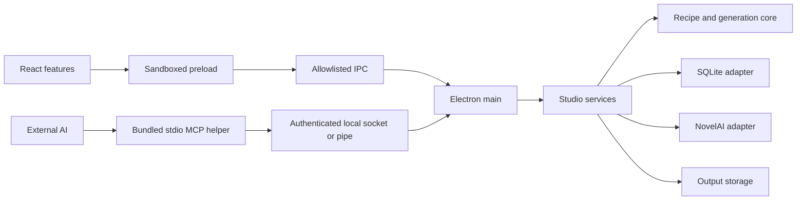

# 아키텍처

UI와 MCP가 같은 서비스와 데이터 계약을 사용합니다. 프롬프트 조립과 정책 검사는 플랫폼에 의존하지 않고, 파일·네트워크·보안 저장은 어댑터와 Electron main에서 처리합니다.

| 폴더 | 책임 |
| --- | --- |
| `contracts/` | 버전이 있는 DTO·명령 입력·오류·이벤트 |
| `core/` | 레시피 조립·검사·비용 정책·범용 팔레트 |
| `lib/` | 기존 동작을 유지하는 순수 프롬프트·블록 유틸리티 |
| `services/` | CRUD·버전 충돌·생성 계획·승인·순차 작업, 셋업 |
| `adapters/` | SQLite·NovelAI 요청·이미지 저장 |
| `features/` | 레시피 편집·생성·갤러리·팔레트·캐릭터·설정 화면 |
| `i18n/` | ko·ja·en 리소스와 언어 선택 |
| `desktop/main/` | 앱 수명·창·토큰·IPC·프로토콜·네이티브 대화상자 |
| `desktop/preload/` | 좁은 `StudioClient` 브리지 |
| `desktop/mcp/` | MCP SDK·stdio·로컬 인증·권한 경계 |
| `skills/recipe-studio/` | 동봉하고 설치하는 스킬 원본 |

## 화면 유지

기존 웹 스튜디오의 Tailwind·shadcn 테마와 레이아웃을 재사용합니다. 전역 CSS의 추가 사항은 Electron renderer 밖에 있는 컴포넌트 검색 경로와 로컬 Geist 폰트 연결입니다. 별도의 테마를 덮어씌우지 않습니다. 갤러리의 카드·필터·확대창과 블록 편집 컴포넌트는 기존 마크업을 옮기고 데이터 접근과 표시 문구를 교체합니다.

## 데이터와 동시 편집

레시피 저장은 버전을 남깁니다. UI와 외부 AI가 같은 버전을 수정하면 최신 버전을 읽고 변경을 다시 적용해야 하며, 조용히 덮어쓰지 않습니다. 기본 팔레트는 안정된 ID를 사용하는 범용 항목이고, 개인 레시피나 캐릭터를 시드하지 않습니다.

앱은 Electron `userData` 아래의 독립적인 프로필을 사용합니다. UI나 MCP에서 SQL·임의 파일 경로·토큰 조회를 실행하는 인터페이스를 제공하지 않습니다.

## 편집 기록과 이미지에서 이어 만들기

편집기의 실행 취소·다시 실행은 최대 100개 상태를 메모리에 보관합니다. 변경할 때마다 renderer의 로컬 저장소에 복구 사본을 남기며, 명시적 저장만 SQLite 레시피 버전을 만듭니다. 복구 사본의 기준 버전이 최신 저장본과 다르면 새 레시피로 복구합니다. 저장 요청 중 추가한 편집도 유지합니다.

갤러리의 이어 만들기는 이미지에 기록된 레시피와 실제 생성 설정을 복제해 별도 초안을 엽니다. 같은 시드 또는 새 시드를 선택할 수 있습니다. 새로 생성하는 이미지에는 캐릭터 스냅샷을 포함하고, 과거 이미지에 스냅샷이 없으면 기존 캐릭터 등록 정보가 쓰일 수 있음을 안내합니다.

## MCP 변경 제안

`recipe_propose_changes`는 읽기·쓰기 권한을 가진 연결에서 레시피의 기준 버전, 제안 내용, 이유를 받아 변경안을 저장합니다. 제안만으로 원본은 바뀌지 않습니다. 앱 편집기에서 변경 항목을 비교하고 선택 적용하거나 적용분을 되돌립니다. 적용·되돌리기는 버전 검사 후 레시피 버전과 제안 상태를 같은 트랜잭션에서 갱신합니다. 승인 없이 즉시 저장하는 기존 MCP 명령은 기존 쓰기 권한과 버전 검사를 유지합니다.

## 작업 공간 백업

설정 화면에서 `.naistudio` 파일을 만들고 복원 내용을 검토합니다. 파일 선택·압축 해제·임시 보관은 Electron main이 맡고 renderer에는 30분간 유효한 미리보기 식별자만 전달합니다. ZIP 구조, 경로, 크기, CRC와 콘텐츠 해시를 검증합니다. 현재 한도는 전체 2GB, 파일 20,000개이며 개별 이미지 256MB와 메타데이터 64MB 한도가 별도로 적용됩니다.

백업에는 레시피와 버전, 캐릭터, 팔레트, 이미지와 생성 메타데이터·평가·연결 관계를 포함합니다. 앱 설정, API 토큰, AI 연결 자격 증명, 미저장 초안은 포함하지 않습니다. 복원은 기존 항목을 덮어쓰지 않는 추가 방식이며, 내부 ID를 새 작업 공간에 맞게 연결하고 같은 백업을 반복 추가하지 않습니다. 미리보기 이후 작업 내용이 변경되면 재검토가 필요합니다. 생성이 진행 중이면 백업·복원을 시작하지 않으며, 백업·복원 중에는 다른 데이터 쓰기와 생성 시작을 잠급니다.

## 생성 경계

`generation_prepare`는 레시피와 생성 조건을 고정하며 작업을 시작하지 않습니다. `generate` 권한이 있는 MCP의 새 계획은 예상 비용이 유한하게 확인되고 검증 오류가 없으며 계획당 이미지 수와 Anlas가 연결 한도 안일 때 준비 단계에서 승인 상태가 됩니다. MCP 도구는 응답의 `approved: true`를 확인한 뒤 시작할 수 있습니다. 이미 사용자가 승인한 장수와 비용 한도 안이면 같은 요청을 다시 확인하지 않습니다. 승인 대기·이전·앱에서 만든 계획은 앱 UI에서 승인해야 합니다. 연결 권한, 이미지·Anlas 한도, 연결 폐기와 비용 최신성은 시작 시에도 확인하며 MCP는 한도를 넘길 수 없습니다. 한도를 넘으면 요청을 줄이거나 앱에서 연결 한도를 조정해야 합니다. 시작 요청은 요청 ID를 재사용하면 같은 작업을 반환합니다.

생성 요청은 한 번에 하나씩 처리합니다. 취소하면 진행 중인 응답은 보관하고 다음 요청을 시작하지 않습니다. 네트워크 응답 유실은 과금 여부가 불명확하므로 자동 재시도하지 않습니다. 재시작 때 진행 중이던 작업도 자동으로 다시 생성하지 않습니다.

사용량을 확인하지 못한 계정을 무료로 취급하지 않습니다. 비용은 공급자의 최종 청구를 보장하는 값이 아닌 예상치이며, 확인된 구독과 설정에 따라 판단합니다.

## 프로세스 경계

Renderer는 Node.js를 직접 사용하지 않습니다. `contextIsolation`, sandbox, CSP, 창 이동 제한과 IPC sender 검사를 사용합니다. 토큰은 main의 OS 보안 저장 기능을 통해 보관하고 외부 서비스 요청에 필요한 순간에만 사용합니다. [Electron 보안 지침](https://www.electronjs.org/docs/latest/tutorial/security)

MCP helper는 DB를 직접 열지 않고, 실행 중인 앱의 인증된 로컬 소켓 또는 Windows 파이프에 연결합니다. 각 연결은 별도 자격 증명과 권한을 사용합니다. 셋업은 기존 클라이언트 설정을 보존하며 설치 기록과 일치하는 앱 소유 항목만 갱신·제거합니다.

## 배포

`desktop/release/manifest.json`이 앱·프로토콜·스킬 버전과 대상 플랫폼을 기록합니다. 배포물에는 빌드된 코드·로컬 리소스·MCP 런타임만 포함합니다. 데이터베이스, 환경 파일, 사용자 출력, 소스맵은 배포 검사에서 제외 대상으로 처리합니다. `pnpm build`는 배포물에 실제로 포함되는 패키지의 의존성 폐포에서 `THIRD-PARTY-NOTICES.txt`를 생성하며, 새 외부 패키지를 import하면 `scripts/third-party-notices.cjs`의 루트 목록에 추가해야 테스트가 통과합니다. `v*` 태그는 `Release` 워크플로로 네 대상(macOS arm64·x64, Windows x64, Linux x64)의 초안 릴리스를 만듭니다.
